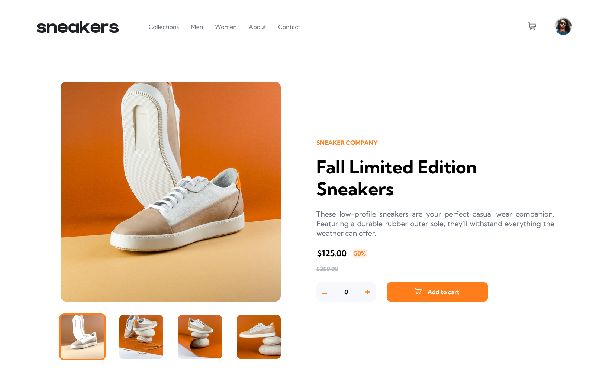
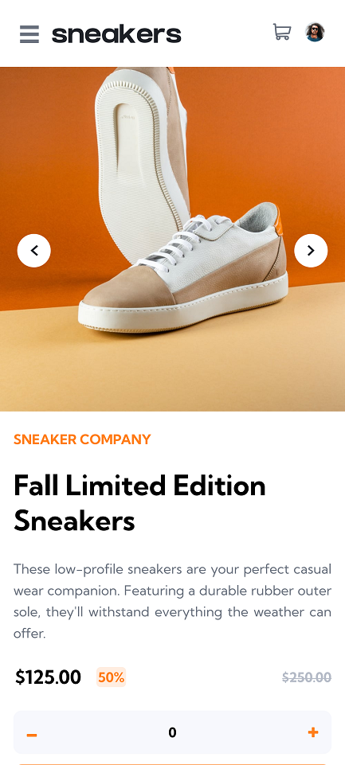

# Frontend Mentor - E-commerce product page solution

This is a solution to the [E-commerce product page challenge on Frontend Mentor](https://www.frontendmentor.io/challenges/ecommerce-product-page-UPsZ9MJp6).
Frontend Mentor challenges help you improve your coding skills by building realistic projects.

### The challenge

Users should be able to:

- View the optimal layout for the site depending on their device's screen size
- See hover states for all interactive elements on the page
- Open a lightbox gallery by clicking on the large product image
- Switch the large product image by clicking on the small thumbnail images
- Add items to the cart
- View the cart and remove items from it

### Screenshot

### How to run

In the project directory, you can run:
`npm start`

Runs the app in the development mode.\
Open [http://localhost:3000](http://localhost:3000) to view it in your browser.

### Links

- Solution URL: [GitHub](https://github.com/PatrykO92/ecommerce_product_page_main)
- Live Site URL: [Netlify](https://e-commerce-challange-fm.netlify.app/)

## My process

### Built with

- HTML5
- CSS
- React

### What I learned

It is always fulfilling to learn new skills and techniques that can enhance the efficiency and functionality of your projects. Recently, I have been focusing on improving my knowledge of React, specifically in the areas of data flow and layout design.

One of the essential skills I have learned is how to pass data from a child component to a parent component using callbacks. This technique has allowed me to create more modular and reusable code, as I can extract common functionality and pass down data between components.

In addition to this, I have also familiarized myself with the useState and useEffect hooks, which are fundamental to building dynamic and interactive applications. These hooks have enabled me to manage state more efficiently and implement side effects with ease.

Lastly, I have delved deeper into the world of layout design, specifically with the use of flexbox. By mastering flexbox, I can create responsive and dynamic layouts.

Overall, I feel more confident in my abilities as a React developer, and I look forward to applying these new skills to future projects.

### Continued development

I am interested in expanding my knowledge of Hooks to write more efficient and maintainable code. Additionally, I aim to improve my proficiency in Tailwind CSS as my next learning objective.

## Author

- Website - [Patryk Orłowski](https://patrykorlowski.netlify.app/)
- Frontend Mentor - [@yourusername](https://www.frontendmentor.io/profile/PatrykO92)
